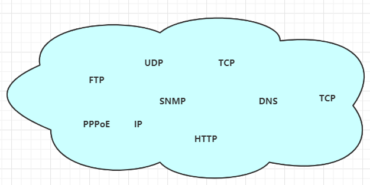
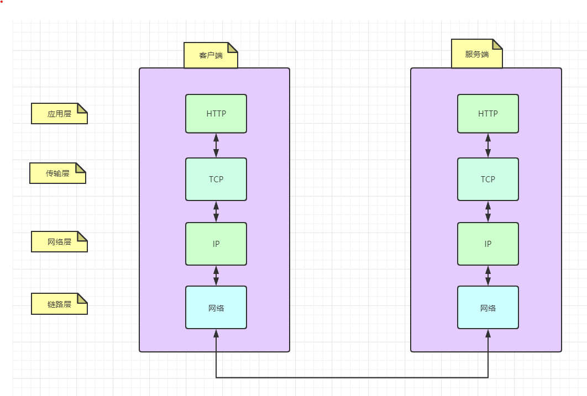
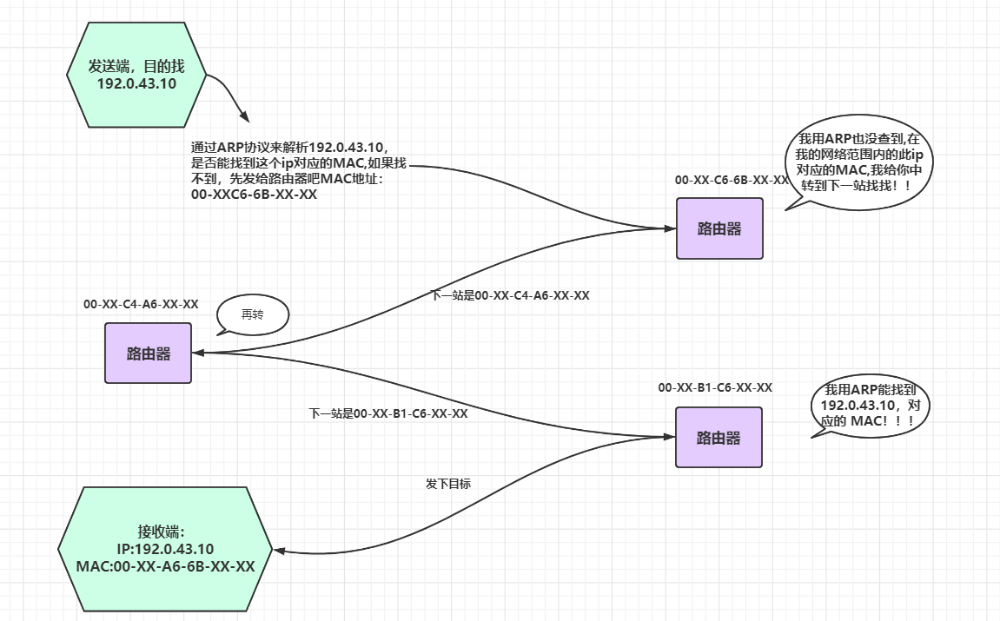
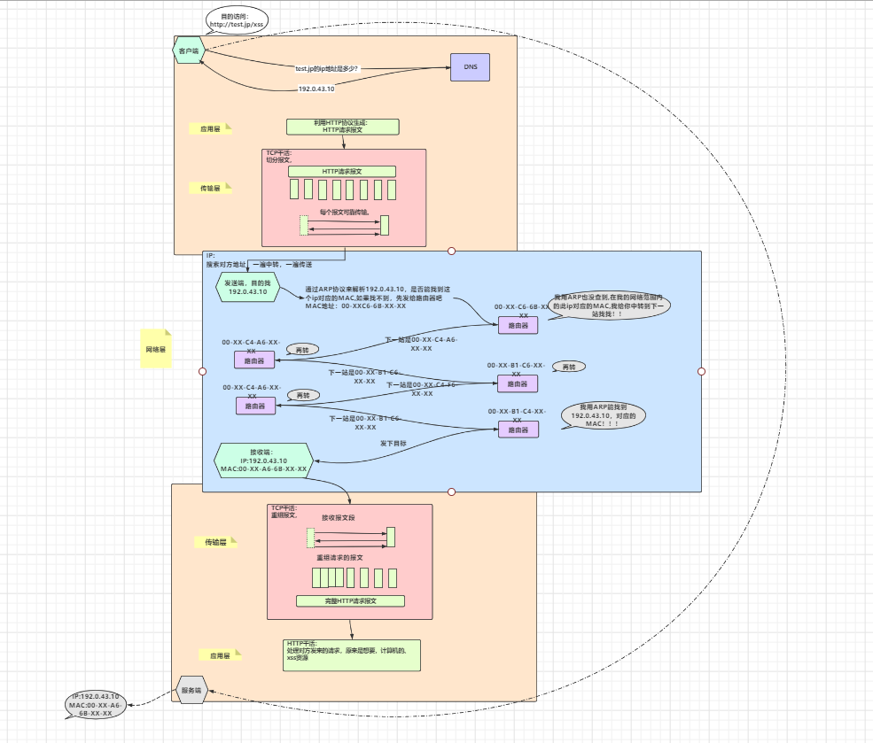

# 一个HTTP请求的网络脉络，解压爽文。

读完此篇会收获什么是一个完整HTTP请求，从客户端发送到服务端，到底经历了什么。

关键词TCP/IP 协议族

# 1**写前的话**


```china
   这是第一次读一本书来用一种摘录的形式记录整理，相信大家多多少少听过此书的名字，一本经典的书------《图解HTTP》,与大家分享，此书共十一章，小编暂时计划将以十一篇博文的形式，分享大家，当然根据权重也可能会合并一些章节。如有侵权请您留言联系，我将立刻处理。
  为什么要分享这本书？或者读这本书对我们自身的价值在哪里？这是我们要不要继续看这篇博文的一个理由。
```
以下是我认为必要的原因：

 1. 完全了解http协议，我们会更加深刻理解Web开发
 2. 对客户端与服务器的通信交互场景细节了然于心。
 3. **思想启发**
  4. 节省时间，我将摘录一些关键节点分享。

**从思维启发来看**：
     上面的第三点，是我认为最重要的一点，深入理解http协议后，我们将会站在一个协议设计者角度，来看待“**协议**”这点事情，这是一个知识或者说是思想启发的迁移，站在高纬度视角，向山下眺望，会给予，肉身仍在山中的我们，清晰明确方向，最终完成目标。
**从学习性价比来看**：
     非常nice!, 一个很扎心的事实，我们后端的开发技术，更新迭代的速度，远快于我们学习的速度，可是万变不离其宗的技术总是有内么几个，例如linux系统内核的io模型，系统的一致性,网络.....大家千万不要内心升起来那种，（这些都是偏底层的我学他干嘛啊，有时间还不如搞两个框架，新技术工具，拓宽一下），因为我以前也是这样想法，可是真正学习了这些偏底层的基础后，去看待一些从前自以为明白的技术，发现有了不一样的理解，而且有了底层基础后，学习新的技术，不会惊叹如此的神奇，而是觉得设计的巧妙！

自己感觉好啰嗦.....上干货吧。

# 2 网络请求概览

## 2.1 http 的产生
### 2.1.1什么叫做协议？
白话说： 协议是规则的约定，我们彼此间约定好一些数据格式，大家尊照预先设计好的格式来传输，这样每个尊重此格式规范的程序，都可以解析，并且，解析好在按照规定的格式来发送，一言以蔽之：前后端开发人员定义好，传的参数和返回参数的字段内容，方便解析。这就是协议。

### 2.1.2http定义

定义：Web使用一种名为HTTP的协议作为规范。术语：超文本传输协议（HyperText  Transfer Protocol）,用它来完成web客户端到，服务端一系列的流程，所以说Web是建立在HTTP协议上的通信的。

### 2.1.3 http诞生历史

#### 怎么来的？

​     制定http的初衷，是致力于全世界的研究者们进行知识共享!!!

源于：欧洲核子研究组织的Tim Berners-Lee 提出让远隔两地的研究者们共享知识的设想，之所以叫超文本，是最初设计理念，想借助多文档之间的相互关联形成的超文本。于是一个著名的词出现啦！"www"表示World  Wide Web 中文翻译， 万维网或者叫做环球网。


www技术的构建由三点组成

1 页面的文本标记语言为HTML

2 所有的文档由URL作为地址标记（统一资源定位符）

3 作为文档传输协议的HTTP

好了我们已经知道了HTTP 协议怎么来的了，知识共享的万维网中，技术构建实现中，需要传输协议，所以， http诞生！！！！。

#### 时间迭代史

1990年问世，并没有正式作为标准建立，因此被称为HTTP/0.9

1996年才作为标准版本定位HTTP/1.0

1997年公布HTTP/1.1,这是目前主流的协议版本（想想97年我还没上学那，那会就已经定型了基本。技术学习性价比还是很高的）

2015年公布HTTP2.0


### 2.1.4浏览器的小插曲

1990年诞生世界第一台web服务器和web浏览器

1992年日本第一个网站主页上线

1993年诞生现代浏览器的祖先NCSA

1994年网景通信公司发布Netspace Navigator1.0

1995年微软发布Internet Eplorer1.0和2.0

19995年  微软与网景公司爆发浏览器大战，两个公司各自对HTML进行扩展，于是出现写HTML页面时必须要考虑兼容两家公司的浏览器！浏览器供应商竞争中，对Web标准化视而不见.....

2000年网景公司衰落，竞争告一段落

2004年Mozilla基金，发布了Firefox,又爆发了浏览器大战....

IE浏览器版本从6 升到7花费了5年，之后不断发展 8 ，9,10,11，听说新版的Microsoft Edge ，好评很多，另外，Chrome,Opera,Safari浏览器也纷纷抢占份额

## 2.2tcp/ip协议族

TCP/IP协议族，这是一个集合，其中就包含HTTP协议如下：



纯手工制图...

不要被这些乱糟糟的协议影响心情，我们大概知道下，除了HTTP 外，哪些协议扮演了什么角色，就能概览一个整体HTTP请求，经过浩瀚的网络传输中到底经历了什么。

TCP/IP ，是一个集合中的总称，之所以叫这个名字我认为那是因为，TCP协议与IP协议太太太重要了！！

下面简单介绍下

下面要用的两个协议：

### 2.2.1DNS

出现DNS的原因就是我们人类不习惯  直接访问http://192.168.XX.XX 这样的网页，如果是字母英文那就好了是吧比如

http://www.taobao.com  http://www.baidu.com  ,所以为了方便服务我们记忆，DNS服务出现了，每次访问这种域名的地址时，DNS协议提供通过查找IP地址。

### 2.2.2TCP

按层次分TCP属于，传输层，提供可靠的字节流服务，即：TCP协议为了传输方便，把大块数据切分成报文段，来发送，并且发送方，根据接收方的响应，能确定数据是否最终到达对方。

#### 经典面试题TCP三次握手 

第一次

第一次握手：建立连接时，客户端发送syn包（syn=j）到服务器，并进入SYN_SENT状态，等待服务器确认；SYN：同步序列编号（Synchronize Sequence Numbers）。
第二次

第二次握手：服务器收到syn包，必须确认客户的SYN（ack=j+1），同时自己也发送一个SYN包（syn=k），即SYN+ACK包，此时服务器进入SYN_RECV状态；
第三次

第三次握手：客户端收到服务器的SYN+ACK包，向服务器发送确认包ACK(ack=k+1），此包发送完毕，客户端和服务器进入ESTABLISHED（TCP连接成功）状态，完成三次握手。

下图使用WireShark 抓包工具的一个tcp握手过程


 

具体演示：

192.168.2.104  por：57335为客户端  我们简称Client，服务端：116.85.x.xxx  port：xxxx   我们简称Server

上图的流程：

第400行： Client首先向Server发送syn包，包序号seq为0

第401行： Server收到Client 的syn包后，将包序号加1，赋值给ack。 ack1=seq+1=1 【seq来自Client】。同时还要发送自己的包序号seq=0。

第402行： Client收到回复之后,需要回复Server。自己的包序号seq=seq+1=0+1=1 【seq来自Client】。同时将服务端的包序号加1，再发送回去。即ack=seq+1=0+1=1 【seq来自Server】


## 2.3网络的分层

TCP/IP协议族这个集合中虽然，包含了很多协议，看起来杂乱，但其实分层来看，还是很清晰的，这里提一点，分层的好处，我们开发时经常会controller  ,service ,dao,其实这就是在分层解耦，试想如果互联网的传输协议仅仅是一个协议搞定，那么如果改动，就需要把整体替换掉，可是如果分层，我们只需要替换被修改的那层即可,分层如下：



纯手工制图...

##  2.4各层介绍

### 2.4.1应用层：

抽象说，应该叫做用户具体的活动干了什么，用规范的协议来书写记录这些活动，然后被传输层发送。

应用层HTTP,FTP,DNS,都属于应用层，白话来说，浏览网页，必然使用http 协议来干活（同时还有DNS），xshell 连接工具中有ftp 传输文件的功能，自然是FTP协议来干活，浏览www.baidu.com 必然要将 域名转换成ip地址,需要的是DNS协议来干活，这些协议一般会预存在我们电脑中。

### 2.4.2传输层

真正在两台计算机间数据传输的方式，一般为两种：UDP,TCP 。

UDP发送数据包无序服务端响应确认，数据传输不可靠，但是速度快。

TCP发送数据包要求服务端确认是否收到,没收到重发！，数据传输可靠，但是速度慢。

根据场景不同我们来选择。举个例子语音通话，采用tcp,如果网络卡顿，重发了声音数据，听起来会前言不搭后语呀，并且说一句话tcp要每次检查是否数据完整，客户时间上体验感会感到巨慢！

### 2.4.3网络层

为传输的数据包选择一个路线，数据包是网络传输最小的数据单位。

在众多的路线中选择一条传输路线。大家脑海中要有一个概念，每个网络请求几乎是通过好多路由层层跳跃到下一个路由，最后才到达目标服务器。所以网络层是选择层层跳跃的路线中选择一个传输路线。

###  2.4.4链路层

用来处理网络连接硬件的部分，例如硬件设备驱动，网卡，等物理可见部分。

网络请求流程图细化


纯手工制图...

### 特别注意

可以看到每层协议都对数据封装，需要注意的是为了传输方便，**一个http请求的内容，会被TCP分割成多个片段来传输。另外IP协议是几乎所有使用网络的系统都会用到IP协议，用来传输数据包有两个总要条件，ip地址，和MAC地址，**（mac地址是每台电脑出厂的一个唯一id),这里我要插条ARP协议的内容（https://blog.csdn.net/weixin_41955327/article/details/85562687）及其简单3分钟内的内容 帮你了解ARP是个什么东东。强烈建议看下。

在解释下上面说的层层跳跃的意思：

到达通信目标前的中转过程中，那些计算机和路由器等网络设备能获悉很粗略的传输路线。这种机制成为路由选择机制。请看下图：



纯手工制图...

如上图层层跳跃的意思不断的中转

# 3总体流程图


  这个截屏不是很清晰，稍后我会把原图地址放到最后，可以网页查看原图地址，所有的图都在这里。



纯手工制图...

如果你能看到这里了，不如点赞关注一波，我会认真分享每一篇博文。大家共同成长。

我的公众号：茄子的笔记

**赠人玫瑰，手有余香，你的关注，我的动力！**

**更多分享可见：**


